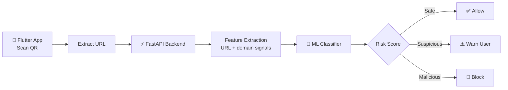

<!-- ============================================================
  GitHub Profile README: Mohanraji K
  TODO: replace every "YOUR-REPO-NAME" link with your real repo name.
  ============================================================ -->

<!-- HEADER BANNER -->
<div align="center">


<a href="https://github.com/mohanrajkrishnamoorthy21-max">
  
</a>

<br/>


<br/><br/>

[](https://www.linkedin.com/in/mohanraji-k-a41783326/)
[](mailto:mohanrajkrishnamoorthy21@gmail.com)
[](https://github.com/mohanrajkrishnamoorthy21-max)

</div>

---

## 👨‍💻 About Me

I build **intelligent, secure, full-stack applications**: from the React/Next.js interface, through FastAPI services, to the ML models that power them. I'm especially interested in **agentic AI**, **RAG pipelines**, and applying a **security-first mindset** to AI systems.

| | |
|---|---|
| 🔭 **Currently building** | Multi-agent AI systems with human-in-the-loop workflows |
| 🌱 **Currently learning** | LLMs · Agentic AI · RAG · MLOps · Ethical Hacking |
| 🎯 **Looking for** | Internships, open-source collaboration, and real-world AI projects |
| 💬 **Ask me about** | Python, FastAPI, React, ML pipelines, phishing detection, data analytics |
| ⚡ **Fun fact** | I like turning messy data into clear stories |

<details>
<summary><b>🐍 Prefer it in code? Click to expand</b></summary>

```python
class Developer:
    def __init__(self):
        self.name = "Mohanraji K"
        self.roles = ["Full Stack Developer", "AI Engineer",
                      "Data Analytics Enthusiast", "Cybersecurity Enthusiast"]
        self.languages = ["Python", "JavaScript", "TypeScript", "SQL", "Java", "Bash"]
        self.currently_learning = ["LLMs", "Agentic AI", "RAG", "MLOps", "Cybersecurity"]
        self.philosophy = "First, solve the problem. Then, write the code."

    def say_hi(self):
        print("Thanks for visiting my profile! Let's build something great.")

Developer().say_hi()
```

</details>

---

## 🛠️ Tech Stack

<div align="center">


<br/>
<sub><b>Languages</b></sub>

<br/><br/>


<br/>
<sub><b>Frontend & Mobile</b></sub>

<br/><br/>


<br/>
<sub><b>Backend</b></sub>

<br/><br/>


<br/>
<sub><b>AI / ML & Data</b></sub>

<br/><br/>


<br/>
<sub><b>DevOps & Security</b></sub>

</div>

<details>
<summary><b>📦 Full toolbox (click to expand)</b></summary>
<br/>

| Area | Tools |
|---|---|
| 🤖 **GenAI & Agents** |     |
| 📊 **Analytics & BI** |     |
| 🛡️ **Security** |     |

</details>

---

## 🚀 Featured Projects

<table>
<tr>
<td width="50%" valign="top">

### 🔐 QR Shield
**AI-powered smart anti-phishing QR scanner**

Scans QR codes and flags malicious links in real time using an ML classifier behind a FastAPI service.


[📂 Repository](https://github.com/mohanrajkrishnamoorthy21-max/YOUR-REPO-NAME) · [🎥 Demo](#)

</td>
<td width="50%" valign="top">

### 🤖 Peer Review Simulator
**Multi-agent academic peer-review system**

Specialised AI agents review a paper from different angles, with a human-in-the-loop step before the final decision.


[📂 Repository](https://github.com/mohanrajkrishnamoorthy21-max/YOUR-REPO-NAME) · [🎥 Demo](#)

</td>
</tr>
<tr>
<td width="50%" valign="top">

### 📊 Kaggle Capstone
**Data analytics & machine learning capstone**

End-to-end workflow: cleaning, EDA, feature engineering, modelling, and evaluation.


[📂 Notebook](https://github.com/mohanrajkrishnamoorthy21-max/YOUR-REPO-NAME) · [📈 Kaggle](#)

</td>
<td width="50%" valign="top">

### 🌐 Full Stack Applications
**Modern, production-style web apps**

Responsive UIs with React/Next.js, backed by typed FastAPI services and SQL databases.


[📂 Repository](https://github.com/mohanrajkrishnamoorthy21-max/YOUR-REPO-NAME) · [🌍 Live](#)

</td>
</tr>
</table>

<details>
<summary><b>🧩 How QR Shield works (architecture)</b></summary>



</details>

---

## 🧭 Learning Roadmap

| Focus | Status | Progress |
|---|---|---|
| Large Language Models (LLMs) | 🟢 In progress |  |
| Retrieval Augmented Generation (RAG) | 🟢 In progress |  |
| Multi-Agent AI Systems | 🟢 In progress |  |
| MLOps | 🟡 Getting started |  |
| Cloud Computing | 🟡 Getting started |  |
| Ethical Hacking & Advanced Cybersecurity | 🟡 Getting started |  |

> 📝 Progress bars are my own rough estimates. Adjust them as you go.

---

## 📈 GitHub Analytics

<div align="center">


<br/>


<br/>


<br/>


</div>

---

## 🏅 Focus Areas

| 🤖 AI & ML | 🌐 Full Stack | 📊 Data Analytics | 🛡️ Cybersecurity |
|:---:|:---:|:---:|:---:|
| Agentic systems, ML classifiers, RAG | React, Next.js, FastAPI, SQL | EDA, dashboards, Kaggle projects | Phishing detection, OWASP, pentest learning path |

---

## 🤝 Let's Collaborate

I'm open to **internships, open-source contributions, and project collaborations**, especially around **AI agents, secure web apps, and data-driven products**.

- 💡 Have an idea? [Open an issue or start a discussion](https://github.com/mohanrajkrishnamoorthy21-max)
- 📬 Want to talk? Reach out below.

<div align="center">

[](https://www.linkedin.com/in/mohanraji-k-a41783326/)
[](mailto:mohanrajkrishnamoorthy21@gmail.com)

<br/><br/>


<br/>

*"First, solve the problem. Then, write the code."*

**⭐ If you like my work, consider starring my repositories!**


</div>
